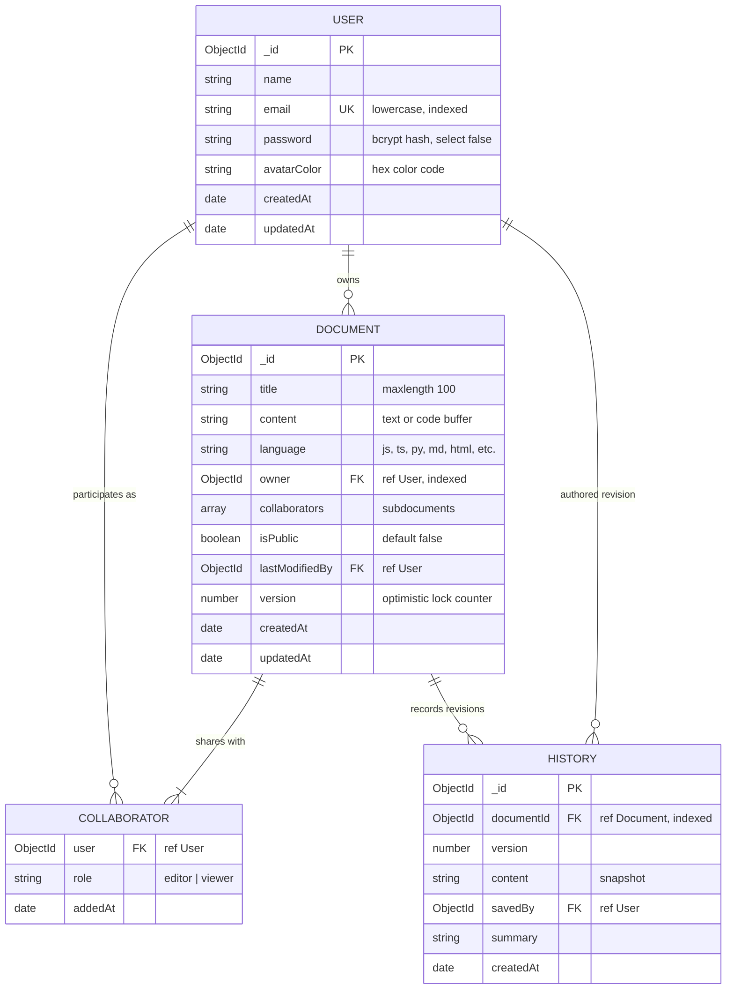
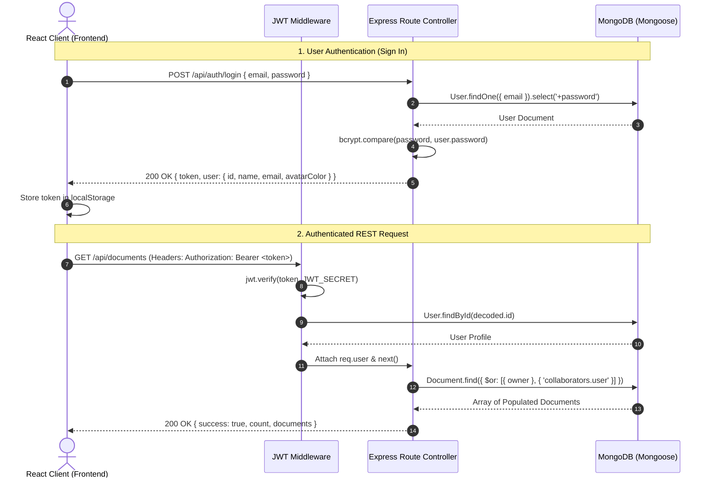
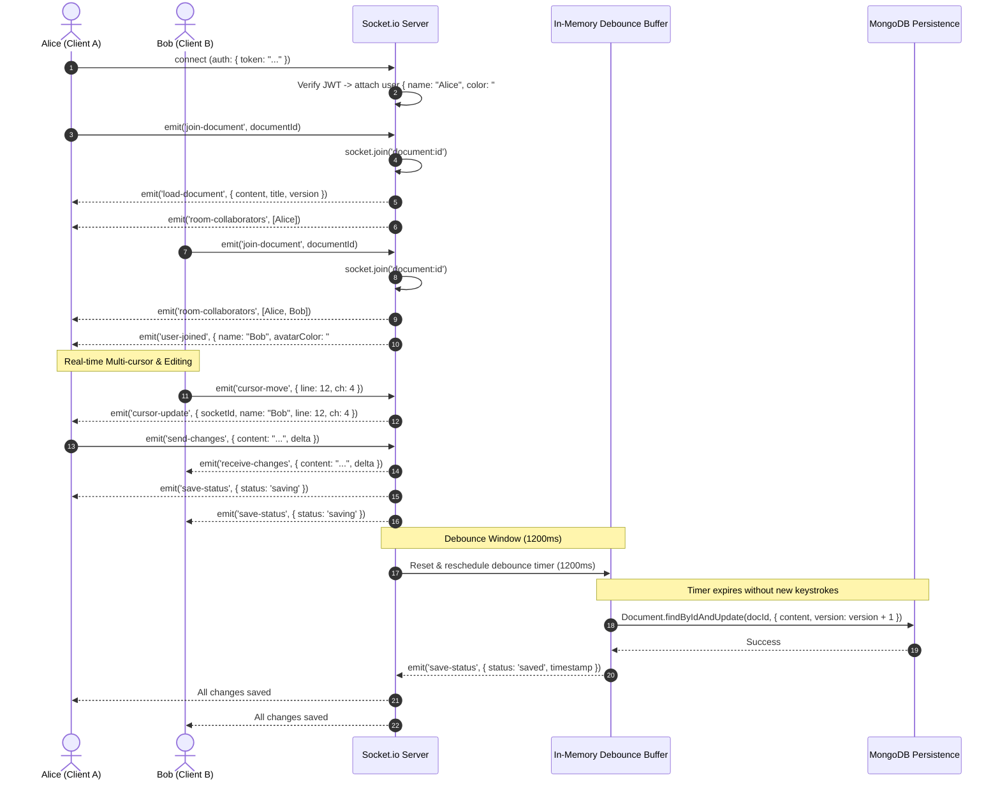

# Architecture & Technical Deep-Dive: SYNC/WAVE Collaborative Platform

This document provides a comprehensive, step-by-step architectural breakdown of the **SYNC/WAVE** real-time collaborative code and document platform.

---

## Table of Contents
1. [Database Schema Architecture (Mongoose / MongoDB)](#1-database-schema-architecture)
2. [REST API Architecture & Client Communication](#2-rest-api-architecture--client-communication)
3. [Real-Time WebSocket Synchronization & Debounced Saving](#3-real-time-websocket-synchronization--debounced-saving)
4. [Concurrency, Conflict Resolution & Optimistic Locking](#4-concurrency--conflict-resolution)
5. [Local Development, Running & Automated Testing Guide](#5-local-development--testing-guide)

---

## 1. Database Schema Architecture

The database is built on **MongoDB** via **Mongoose**, featuring an indexed schema designed for sub-millisecond document lookups, granular collaborator role delegation, and historical snapshotting.

### 1.1 Entity Relationship Diagram



### 1.2 Schema Design Decisions & Indexing
1. **Compound Indexing for Fast Dashboard Queries**:
   - `documentSchema.index({ owner: 1, updatedAt: -1 })`: Powers the dashboard query fetching a user's workspaces sorted by the most recently edited.
   - `documentSchema.index({ 'collaborators.user': 1 })`: Powers lookups for all workspaces shared with a given user across the organization.
2. **Subdocument vs Reference for Collaborators**:
   - Collaborators are modeled as an embedded subdocument array within `Document` rather than a separate join table. Because team sizes per document are typically small to moderate (< 100), embedding eliminates costly multi-collection joins and ensures atomic updates when adding or removing collaborator access.
3. **Revision Snapshots in History**:
   - Rather than storing every individual keystroke in history, snapshots are stored on creation, explicit user save (`force-save`), or every 5th major version increment. This bounds database storage growth while allowing full revision restoration.
4. **Resilient Connection Engine**:
   - In `server/src/config/db.js`, the backend first attempts to connect to `process.env.MONGODB_URI` (or local MongoDB on port 27017). If unavailable, it dynamically spins up an in-memory embedded MongoDB (`mongodb-memory-server`), ensuring zero-friction local testing out-of-the-box.

---

## 2. REST API Architecture & Client Communication

The REST API manages stateless resource lifecycles: authentication, profile verification, workspace creation/deletion, sharing, and initial document hydration.

### 2.1 Request & Authentication Lifecycle



### 2.2 API Endpoint Directory

| Method | Endpoint | Access | Purpose |
|---|---|---|---|
| `POST` | `/api/auth/register` | Public | Register new user account with hashed password & signed JWT |
| `POST` | `/api/auth/login` | Public | Verify credentials and issue 7-day signed JWT |
| `GET` | `/api/auth/me` | Protected | Verify active session & return sanitized user profile |
| `GET` | `/api/documents` | Protected | Retrieve all workspaces owned or collaborated on |
| `POST` | `/api/documents` | Protected | Create new workspace room and initial revision snapshot |
| `GET` | `/api/documents/:id` | Protected | Fetch workspace by ID with populated owner & collaborators |
| `PUT` | `/api/documents/:id` | Protected | Update title, language, or content via REST |
| `DELETE` | `/api/documents/:id` | Protected | Owner-only deletion of document and revision history |
| `POST` | `/api/documents/:id/share` | Protected | Invite team member by email with `editor` or `viewer` role |
| `GET` | `/api/documents/:id/history` | Protected | Fetch recent revision snapshots |
| `GET` | `/api/health` | Public | Healthcheck reporting uptime & DB connection state |

---

## 3. Real-Time WebSocket Synchronization & Debounced Saving

While REST is ideal for resource creation and metadata, live multi-user editing requires high-frequency, bidirectional communication with sub-15ms latency. This is handled by **Socket.io**.

### 3.1 Real-Time WebSocket & Auto-Save Lifecycle



### 3.2 Why Debounced Auto-Saving Matters
If every keystroke triggered a database `UPDATE` query:
- A user typing at 60 WPM would trigger **5 to 6 database write queries per second**.
- With 10 collaborators in a room, the database would face **50 to 60 write queries per second per document**, resulting in disk I/O bottlenecks and write lock contention.

**The Solution**:
1. Keystrokes are immediately broadcasted to peer clients over WebSockets (< 15ms latency).
2. The server buffers the latest state in a memory map `pendingSaves.set(documentId, { timer, content, lastModifiedBy })`.
3. The debounce timer resets to `1200ms` with each keystroke.
4. When typing pauses for 1.2 seconds, a single atomic write persists the accumulated changes to MongoDB.
5. If a user presses `Ctrl+S` / `Cmd+S`, the client emits `force-save`, which immediately flushes the pending buffer without waiting for the timer.

---

## 4. Concurrency & Conflict Resolution

In collaborative platforms, multiple users may edit simultaneously:
1. **Room State Broadcasting**: The server acts as the authoritative source of room occupancy. When a client joins or leaves, presence rosters are broadcasted to all sockets in that room.
2. **Sender Exclusion**: When a user types, `socket.to(room).emit('receive-changes', ...)` forwards changes strictly to other clients in the room, preventing echo loops on the sender's editor.
3. **Disconnect Resilience**: If all users disconnect or close their tabs, the `disconnecting` event triggers `flushPendingSave(documentId)` immediately, ensuring zero unsaved data is lost when a room becomes empty.

---

## 5. Local Development & Testing Guide

### 5.1 Prerequisites
- Node.js (v18, v20, or v22 recommended; verified on Node v22.23.1).
- npm (v9 or v10).

### 5.2 Directory Structure
```
collab-docs/
├── package.json           # Root orchestration
├── EXPLANATION.md         # This technical specification
├── server/
│   ├── server.js          # Express & Socket.io server
│   ├── src/               # Models, routes, sockets, middleware
│   └── tests/             # Automated test suite
└── client/
    ├── vite.config.js     # Dev server & reverse proxy
    ├── tailwind.config.js # Dark SaaS design tokens
    └── src/               # React pages, components, and contexts
```

### 5.3 Installation & Setup
Run the following commands from the root directory:

```bash
# 1. Navigate to the project
cd collab-docs

# 2. Install all dependencies (root, server, and client)
npm run install:all
```

### 5.4 Starting the Application
```bash
# Start both Backend (Port 5001) and Frontend (Port 5173) concurrently
npm run dev
```

The application will be accessible at:
- **Frontend**: [http://localhost:5173](http://localhost:5173)
- **Backend Healthcheck**: [http://localhost:5001/api/health](http://localhost:5001/api/health)

### 5.5 Running Automated Backend Tests
To execute the comprehensive integration test suite verifying authentication, bcrypt hashing, JWT tokens, document CRUD, and permission access controls:

```bash
npm test
```
